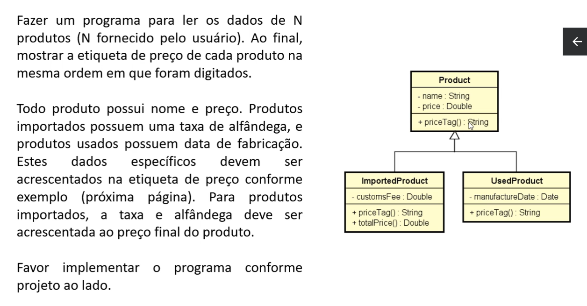
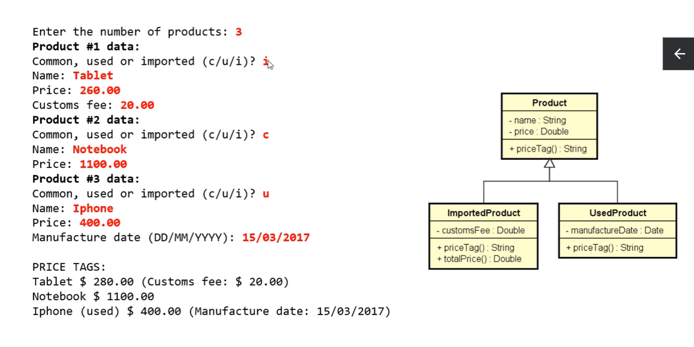
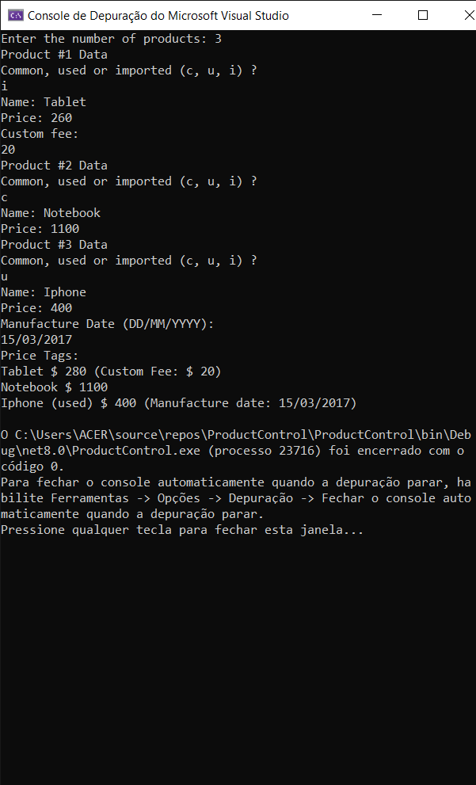

# ProductControl
Programa feito em C# que cria produtos de forma dinâmica usando o conceito de polimorfismo

## Programa baseado em um Diagrama de Classes UML
### 🌱 Utilizando C#, Criei esse programa que adiociona produtos de maneira dinâmica.
### O projeto tem como objetivo praticar o polimorfismo em C#, além da criação dinâmica de Objetos.

# UML usada para a criação do projeto
                                                                      

# Resultado final do programa
 

